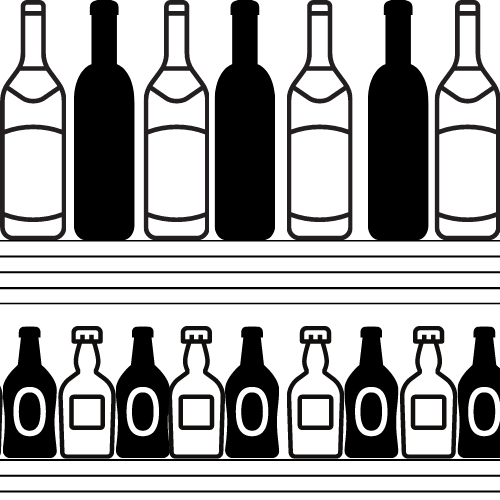
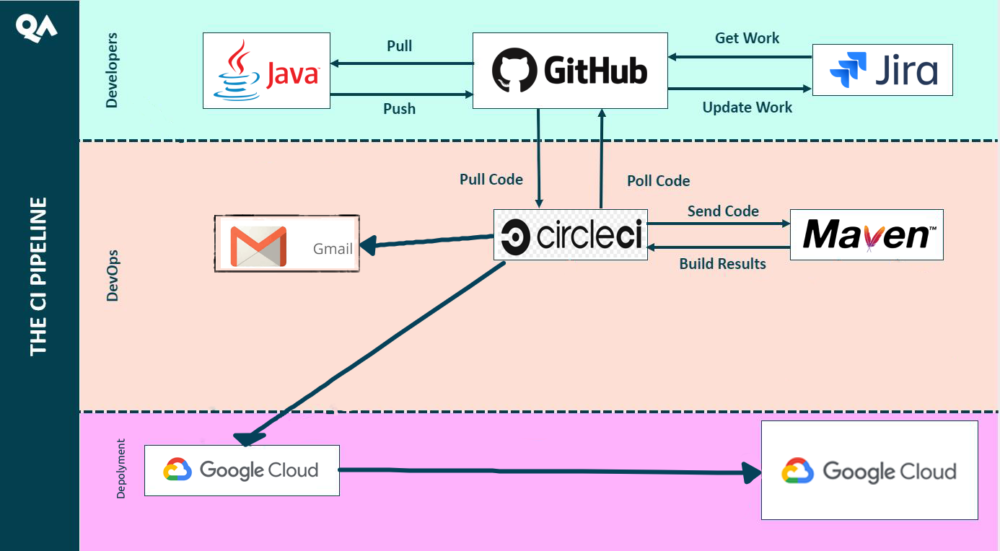
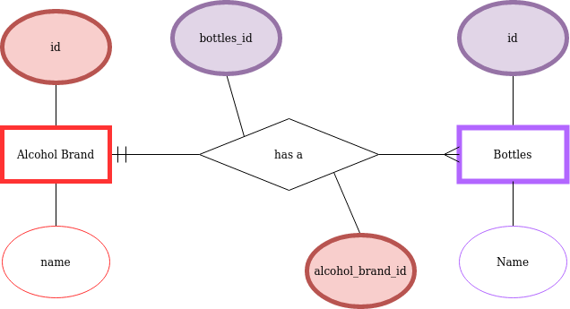

 # Fundamental_Project
QA SFIA1 project

Introduction

# Live Bar Count

## Contents
- [Introduction](#Introduction)
- [Design](#Design)
- [Architecture](#Architecture)
- [Risk Assessment](#Risk%20Assessment)

## Introduction

### Idea
> A weight system to measure liquid in bottles.
### Application
> To be used in hospitality sector, in bars to produce an accurate live stock count

## Planning

### Kanban board 

The Kanban board is used to organise a project. The tasks are set into Epics which is a list of the main goals to achieve. These main goals are accompanied by stories and tasks which are the aims and objectives of the goal. The aims are smaller tasks that need to be completed to achieve the goals and objective are the most granular type of task.
Using a Kanban board aims to maximise efficiency and to monitor work progression. The Atlassian software being used for this project is filled with functionality to measure the productivity of my development. Monitoring work like this allows for the Business operations team to make decisions about the product, such as when they believe the product will be ready to realise.
The second reason people use a kanban board, through Jira is to maximise efficiency. Using a monitoring system like this is excellent because it helps focus people on the essential tasks and the progression of the project can be viewed which motivates people to complete the task.
The final and most important thing the Jira board does is help the project move towards the MPV, which is essential to the project. Having the minimum viable product allows the business to sell its product and pay the developers while they work on improving and adding new features.

### Planning breakdown

This section will focus on how the proposed project will reach it minimum MVP on each relase release the versions.
The versions will be dictated from a MoSCoW product point of view:
* MUST have:
> Minimus Viable Product 
> Have 1 C, R,U and D happening.
> Have back end running on Google vm

* SHOULD have:
> A second CRUD process running
> Impliment testing and see if the testing goes into 

* COULD have:
> Create waste, bar, company class 
> Design front end and 
> Allow access to front end on the google VM

* WON'T HAVE: 
> Scaling of Virtual Machines

### Continuous Integration Pipeline 

## Design

### UML

#### Database Design 

#### Bar Session

#### Pour Bottle 

### Class Diagram

### Website view

#### Enter new Bottle

#### Till System

## Risk Assessment

### Technical risk assessment

|Risk_ID                  |Description                                                       |Assessment                                   |Risk  |Impact |Responsiblity |Current Mitigration      |Proposed Mitigration|Respone|Tolorance|
|-------------------------|------------------------------------------------------------------|---------------------------------------------|------|-------|--------------|-------------------------|--------------------|-------|---------|
|0_0001                   |Java test not complete                                            |                                             |      |       |              |                         |                    |       |         |
|0_0002                   |README.md not complete                                            |                                             |low   |low    |low           |Monitor readme           |                    |       |         |
|0_0003                   |Unit test not evaluating function correctly                       |Function will not produced desired output    |high  |high   |              |Design unit tests        |                    |       |         |
|0_0004                   |Integration test not evaluation combination of function correctly |Combined functions don't pass data correctly |hight |high   |              |Design integration tests |                    |       |         |
|0_0005                   |Create function fails                                             |                                             |      |       |              |                         |                    |       |         |
|0_0006                   |Read function fails                                               |                                             |      |       |              |                         |                    |       |         |
|0_0007                   |Update function fails                                             |                                             |      |       |              |                         |                    |       |         |
|0_0008                   |Delete function fails                                             |                                             |      |       |              |                         |                    |       |         |
|0_0009                   |Loss of internet                                                  |                                             |      |       |              |                         |                    |       |         |
|0_0010                   |Damage to internet infrastructure                                 |                                             |      |       |              |                         |                    |       |         |

### Personal Risk assessment

|Description                                                     |Assessment                                                                                                                                                                                                                                                                                                                                                                                                                                                                                                                                                                                                                                                                                                                                                                                                                                                                                                 |Risk  |Impact |Responsiblity        |Current Mitigration                                                                            |Proposed Mitigration                                                                                                                       |Respone                                                                   |Tolorance                                                                                                   |
|----------------------------------------------------------------|-----------------------------------------------------------------------------------------------------------------------------------------------------------------------------------------------------------------------------------------------------------------------------------------------------------------------------------------------------------------------------------------------------------------------------------------------------------------------------------------------------------------------------------------------------------------------------------------------------------------------------------------------------------------------------------------------------------------------------------------------------------------------------------------------------------------------------------------------------------------------------------------------------------|------|-------|---------------------|-----------------------------------------------------------------------------------------------|-------------------------------------------------------------------------------------------------------------------------------------------|--------------------------------------------------------------------------|------------------------------------------------------------------------------------------------------------|
|Time to learn.                                                  |Time to learn to learnt he new technologies has been minimal. The amount of time spent on java, springboot, circleCi, HTML, CSS, database design/database query language etc. Has been minimal.                                                                                                                                                                                                                                                                                                                                                                                                                                                                                                                                                                                                                                                                                                            |high  |high   |Jake Stone           |Notes, pictures, videos, when something is not understood ask team members and Teachers at QA. |Only adding code/application that is understood so that if something breaks it can be easily fixed.                                        |weak - how to measure understanding of every function within application? |low - This reposnse is a better response than doing nothing and implimenting things that are not understood.|
|Scope of work is poorly specified                               |When given the mark scheme, I was told I need to develop an application that needed to have C(reate)R(ead)U(pdate)D(elete) functionality. The rest of the scope was defined by myself.                                                                                                                                                                                                                                                                                                                                                                                                                                                                                                                                                                                                                                                                                                                     |low   |high   |Jake Stone/QA mentors|Design application with good planning with Jira board                                          |To have different versions of the project to scale back the scope quickly if have went too far with the scope.                             |Good                                                                      |High                                                                                                        |
|Unexpected changes and uncontrolled growth to a project’s scope.|If my project gets taken on by other people interested in developing it                                                                                                                                                                                                                                                                                                                                                                                                                                                                                                                                                                                                                                                                                                                                                                                                                                    |low   |low    |Jake Stone           |Ignore other developers if they want to push to my project                                     |Put GitHub project on private so nobody can fork it and add the markers as contributors so nobody can fork my project and develop it for me|Good                                                                      |High                                                                                                        |
|Disengaged stakeholders                                         |For the purpose of this excercise - let imagine I am developing a piece of software for a group of companies. The customers, myself, bar staff and companies using the product are the stakeholders. The customers and the bar staff may not like the new system, they may find it hard to put the bottle back in the same place and the customers - at the bar - may find service slow and get annoyed. Myself, the developer will be constantly trying to improve the product to make it faster and easier to use. The companies that are paying for the procduct will be the most important stakeholder because they are the ones paying for the product. They will like the fact the data is there in real time but they may have H&S requirements they have to stick to so before the product is put into production there needs to be tests carreid out on whether the scale pass these requirements.|low   |high   |Jake Stone           |Design software and then test the product                                                      |Null                                                                                                                                       |Good                                                                      |High                                                                                                        |

